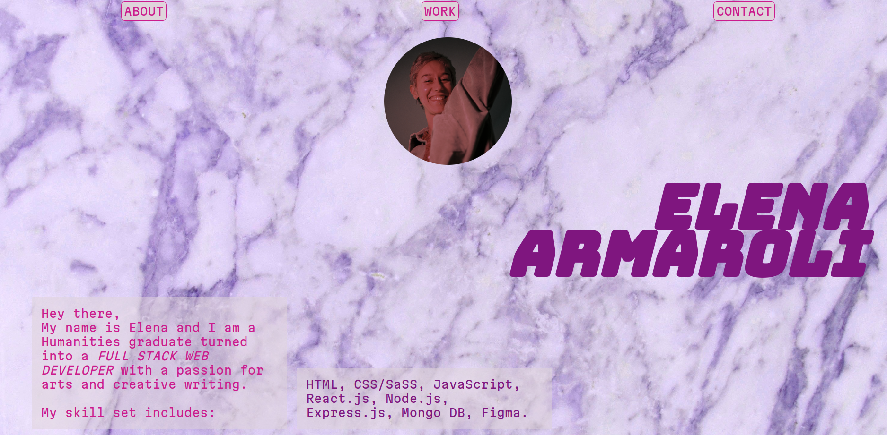

# My-Portfolio

## Table of Contents
- [Introduction](#introduction)
- [Developers](#developers)
- [Features](#features)
- [Requirements](#requirements)
- [Usage](#usage)
- [Technologies Used](#technologies-used)
- [Project Structure](#project-structure)
- [Screenshot](#screenshot)

## Introduction
In this portfolio project I am showcasing my main works, experience and background, as well as offering the chance to contact me. Built using MERN Stack and UI/UX fully designed by me. 
Deployed version available [here](https://elena-armaroli-portfolio.onrender.com/).

# Developers
This is an individual project, meaning I am the only developer behind it. I also completely designed the UI and UX of the website. You can find me [here](https://github.com/elenarmaroli).

## Features
- Navbar with internal links
- "About" section on my skills and profile
- "My work" section with images linked to real life projects I worked on
- "Contact" section with functioning contact form
- Footer 

## Requirements
- npm install
- Node.js
- MongoDB
- React.js
- Express.js
- express-validator
- mongoose
- nodemon
- cors
- dotenv
- react-hook-form
- react-toastify

## Usage
- To run client side: npm start
- To run server side: nodemon app.js / npm start
- Access the application at `http://localhost:3000`

## Technologies Used
- MongoDB
- Express.js
- React.js
- Node.js
- Git & Github
- Postman
- npm 
- Fontawesome icons
- CSS
- express-validator
- mongoose
- nodemon
- cors
- dotenv
- react-hook-form
- react-toastify

## Project Structure
- `my-portfolio/`: Contains the frontend React.js code.
- `server/`: Contains the backend Express.js code.

## Screenshot
Here, you can see the sleek and user-friendly interface, enriched with CSS animations.

